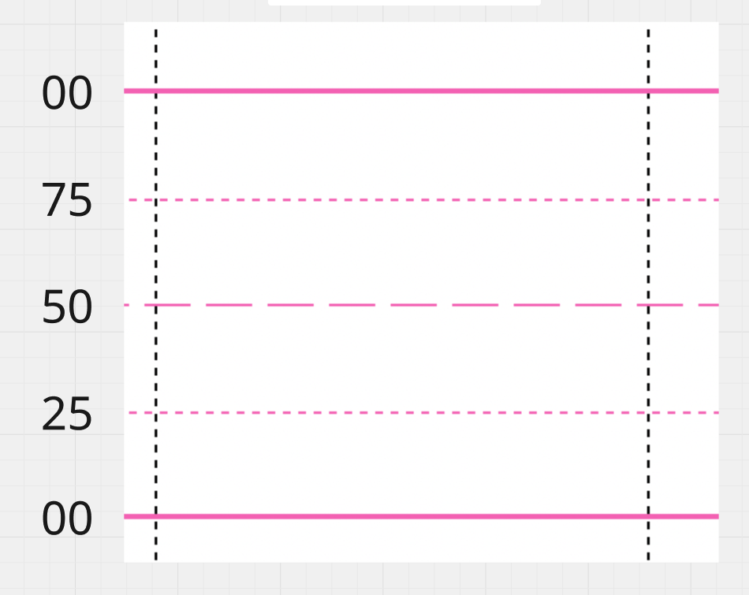
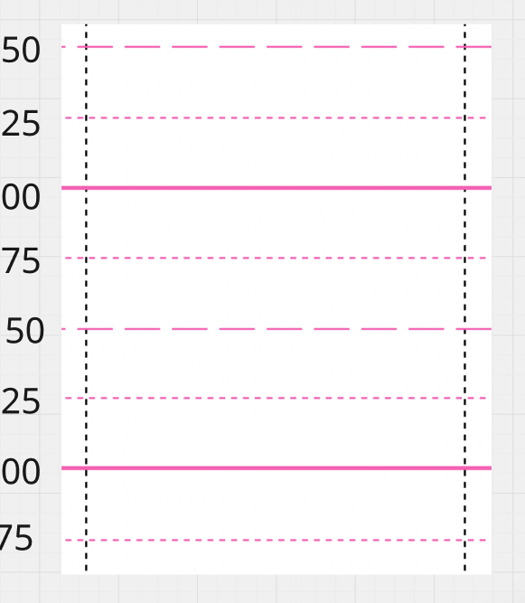

# Institutional Grid — Visual Level Encoding

## Purpose

This file defines how the institutional 00 / 25 / 50 / 75 grid is visually represented on the user's charts.

This is a chart-reading rule used for WHERE validation.

## Visual Encoding

### 00

A solid / continuous pink horizontal line represents:

00

### 50

A long-dashed / segmented pink horizontal line represents:

50

### 25 and 75

A short-dashed / dotted pink horizontal line represents either:

25

or:

75

The surrounding institutional grid determines which one it is.

## Repeating 00-to-00 Structure

The institutional grid repeats inside every 00-to-00 box.

Moving upward from a lower 00:

00
-> 25
-> 50
-> 75
-> next 00

Moving downward from an upper 00:

00
-> 75
-> 50
-> 25
-> next 00

Therefore a dotted / short-dashed line should be identified from its position inside the surrounding 00-to-00 structure.

Do not identify 25 versus 75 from line style alone when the surrounding grid context is unavailable.

## WHERE Priority

- 00 and 50 are Tier 1 institutional levels.
- 25 and 75 are Tier 2 institutional levels.
- Tier 2 remains fully valid; it is lower priority, not invalid.

## Important Color Rule

Do not assign meaning to other horizontal-line colors by color alone.

For example, a green or teal horizontal line is NOT automatically a closing-price reference.

Its meaning must come from:

- chart context
- labels
- user annotation
- or an already taught rule for that specific chart

Color alone does not manufacture a valid WHERE reference.

## Canonical Visual References

### One Complete 00-to-00 Box

This reference shows one complete institutional grid box:

00
-> 25
-> 50
-> 75
-> next 00

### Repeating 00-to-00 Structure

This reference shows how the same institutional grid repeats continuously from one 00 box to the next.
